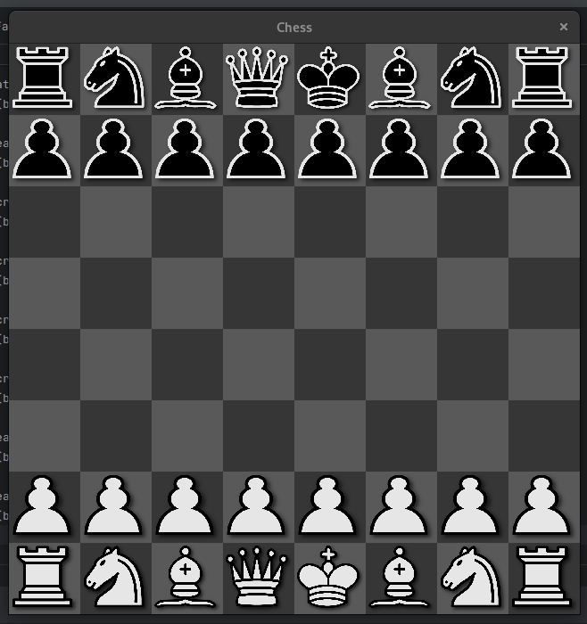

Chess Game - SDL
Descrição

Este é um jogo de xadrez desenvolvido em C++ utilizando a biblioteca SDL. O objetivo do projeto é criar uma interface gráfica para o tabuleiro de xadrez, onde os jogadores podem visualizar as peças e interagir com o jogo. A implementação inclui uma fábrica de peças, que é responsável pela criação das peças de xadrez com suas respectivas texturas e posições no tabuleiro.

Funcionalidades

    Tabuleiro de xadrez 8x8 desenhado em SDL.
    Peças de xadrez pretas e brancas com texturas próprias.
    Sistema de fábrica para criação das peças, permitindo fácil expansão e modificação.
    Movimentação e lógica de jogo (em progresso).

Pré-requisitos

Para rodar o projeto, você precisará ter as seguintes dependências instaladas:

    C++17 ou superior
    SDL2
    SDL2_image (para manipulação de texturas)

Como rodar

    Clone o repositório:

    bash

git clone https://github.com/seuusuario/chess-game-sdl.git
cd chess-game-sdl

Instale as dependências (no Ubuntu):

bash

sudo apt-get install libsdl2-dev libsdl2-image-dev

Compile o código:

bash

g++ -std=c++17 src/*.cpp -o chess-game -lSDL2 -lSDL2_image

Execute o jogo:

bash

    ./chess-game

Estrutura do Projeto

makefile

.
├── assets/          # Imagens das peças e tabuleiro
├── src/             # Código-fonte do jogo
│   ├── main.cpp     # Ponto de entrada do jogo
│   ├── factory.cpp  # Implementação da fábrica de peças
│   └── renderer.cpp # Renderização das peças e tabuleiro
├── include/         # Cabeçalhos das classes
└── README.md        # Este arquivo

Em progresso: Criando o sistema de movimentação das peças, ao clicar no pião já é possível visualizar quais casas ele pode ir
, entretanto, o sistema não detecta capturas, ainda, falta só expandir para essa funcionalidade e adicionar as regras de movimentação
para as outras peças, além de corrigir um erro de vazamento de memória detectado em código.

Próximos Passos

Implementar a movimentação das peças.
Adicionar lógica de captura e xeque-mate.
Desenvolver um sistema de jogadas válidas.

    Criar uma IA básica para o jogador oponente.
